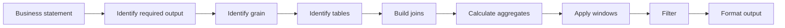

---

SQL Problem Solving Approach:

---

For complex problems, I recommend this mental model:

---

# 1. First question: What exactly is being asked?

Suppose the problem says:

**Find the top 2 products by revenue in each category for every month of 2025. Also display the previous month's revenue for each product and the percentage change from the previous month. Only include products whose monthly revenue is greater than the average monthly revenue of all products in that category.**

This looks complicated because it contains several requirements.

Don't write SQL immediately.

Break the statement into pieces.

### Requirement 1

"for every month of 2025"

This tells us:

**We need date manipulation / month extraction.**

Likely:

**DATE\_FORMAT(order\_date, '%Y-%m-01')**

or another month-start expression.

---

### Requirement 2

"revenue"

This tells us:

quantity × unit\_price

and therefore:

SUM(quantity \* unit\_price)

So we need **aggregation**.

---

### Requirement 3

"for each category"

We need:

GROUP BY category

---

### Requirement 4

"for each product"

We need product-level granularity:

month + category + product

This is extremely important.

Before writing SQL, ask:

**What does one output row represent?**

Here:

**One row = one product's revenue in one category for one month.**

That's the **grain**.

---

### Requirement 5

"top 2 products in each category"

This is the big clue.

Whenever you see:

top N **within each group**

think:

ROW\_NUMBER()

RANK()

DENSE\_RANK()

Usually:

ROW\_NUMBER() OVER (

   PARTITION BY category\_id, month

   ORDER BY revenue DESC

)

Notice the word:

**each**

"Top 2 overall" → ORDER BY ... LIMIT 2

"Top 2 in each category" → PARTITION BY category

This is one of the most important SQL pattern-recognition skills.

---

# 2. Build a requirement → SQL functionality map

When reading a problem, mentally convert words into SQL operations.

**Problem statement contains**

**Think about**

total

SUM()

average

AVG()

minimum

MIN()

maximum

MAX()

number of

COUNT()

unique number of

COUNT(DISTINCT)

per customer

GROUP BY customer

per month

date grouping

per category

GROUP BY category

only groups satisfying condition

HAVING

filter individual rows

WHERE

top N overall

ORDER BY + LIMIT

top N per group

ROW\_NUMBER/RANK/DENSE\_RANK

previous row

LAG()

next row

LEAD()

running total

SUM() OVER()

percentage change

arithmetic + LAG()

compare with average

aggregate/subquery/window

highest/lowest within group

ranking/window

employee and manager

self join

customers with orders

JOIN

customers without orders

LEFT JOIN + IS NULL

existence

EXISTS

records not matching another set

NOT EXISTS, NOT IN, EXCEPT

conditional calculation

CASE

multiple conditions

CASE / boolean logic

combine datasets

UNION

remove duplicates

DISTINCT

monthly comparison

LAG()

consecutive months

LAG() + date logic

first/last record

ROW\_NUMBER, FIRST\_VALUE, LAST\_VALUE

percentage of total

window SUM() OVER()

duplicate records

GROUP BY + HAVING COUNT(\*) > 1

This becomes your **SQL problem decoder**.

---

# 3. The most important concept: Identify the grain

Before writing a query, ask:

**What should one row in my final result represent?**

For example:

### Problem

Find total spending of every customer.

Grain:

1 row = 1 customer

Therefore:

GROUP BY customer\_id

---

### Problem

Find monthly sales for every product.

Grain:

1 row = 1 product + 1 month

Therefore:

GROUP BY product\_id, month

---

### Problem

Find the top 3 products in each category every month.

Grain:

1 row = 1 product + 1 category + 1 month

Then ranking happens **after** aggregation.

This distinction is critical.

---

# 4. Learn to identify the SQL "layers"

Complex SQL is usually not one problem.

It is several smaller problems stacked together.

For the example above:

Layer 1

Get orders

     ↓

Layer 2

Join products/categories

     ↓

Layer 3

Calculate monthly product revenue

     ↓

Layer 4

Calculate category average

     ↓

Layer 5

Rank products within category/month

     ↓

Layer 6

Get previous month's revenue

     ↓

Layer 7

Calculate percentage change

     ↓

Layer 8

Filter top 2 + revenue condition

This is much easier than thinking:

"I need to write one huge SQL query."

---

# 5. Start with the tables

Imagine these tables:

customers

\---------

customer\_id

customer\_name

orders

\------

order\_id

customer\_id

order\_date

order\_items

\-----------

order\_id

product\_id

quantity

unit\_price

products

\--------

product\_id

product\_name

category\_id

categories

\----------

category\_id

category\_name

Now ask:

Which tables contain the information I need?

We need:

order\_date

quantity

unit\_price

product

category

Therefore:

orders

  ↓

order\_items

  ↓

products

  ↓

categories

---

# 6. Build the query from the inside out

Don't start with:

SELECT ...

Start by solving the smallest question.

## Question 1

What is the revenue generated by each product each month?

Conceptually:

SELECT

   product\_id,

   month,

   SUM(quantity \* unit\_price) AS revenue

FROM ...

GROUP BY

   product\_id,

   month;

At this point, forget about ranking.

Forget about LAG().

Forget about percentage change.

Solve this first.

---

# 7. Then add the category

Now we need:

product

category

month

revenue

So join:

products → categories

and produce:

product\_id

product\_name

category\_id

category\_name

month

revenue

Now we have a useful intermediate dataset.

Think of this as a temporary table in your mind:

monthly\_sales

category | product | month | revenue

\---------|---------|-------|--------

Electronics | Laptop | Jan | 50000

Electronics | Phone  | Jan | 40000

Electronics | Mouse  | Jan | 10000

Furniture | Chair | Jan | 20000

Furniture | Desk  | Jan | 30000

---

# 8. Now recognize the window-function requirement

The statement says:

Top 2 products **in each category for every month**

This phrase should immediately trigger:

RANK() OVER (

   PARTITION BY category\_id, month

   ORDER BY revenue DESC

)

Why?

Imagine:

Electronics | Jan | Laptop | 50,000

Electronics | Jan | Phone  | 40,000

Electronics | Jan | Mouse  | 10,000

Furniture   | Jan | Desk   | 30,000

Furniture   | Jan | Chair  | 20,000

We want ranking to restart here:

Electronics / Jan

Laptop  → 1

Phone   → 2

Mouse   → 3

and separately:

Furniture / Jan

Desk    → 1

Chair   → 2

That's exactly what:

PARTITION BY category\_id, month

does.

---

# 9. Now recognize the LAG requirement

The statement says:

previous month's revenue

That should immediately trigger:

LAG(revenue)

For example:

Month       Revenue    Previous Revenue

\---------------------------------------

Jan         10000      NULL

Feb         12000      10000

Mar         9000       12000

Apr         15000      9000

So:

LAG(revenue) OVER (

   PARTITION BY product\_id

   ORDER BY month

)

The PARTITION BY tells SQL:

Compare this product with its own previous month.

---

# 10. Percentage change

Once you have:

current revenue

previous revenue

the business formula becomes:

(current - previous) / previous × 100

SQL:

(

   revenue - previous\_revenue

) / previous\_revenue \* 100

So an important habit is:

**Separate business mathematics from SQL syntax.**

First understand the formula.

Then translate the formula into SQL.

---

# 11. Now recognize the "average" requirement

The statement says:

monthly revenue is greater than the average monthly revenue of all products in that category.

Again, don't immediately write SQL.

Ask:

Average of what?

Here:

For each category + month

   calculate average product revenue

So conceptually:

AVG(revenue) OVER (

   PARTITION BY category\_id, month

)

This is another powerful pattern.

When you see:

compare each row against the average of its group

think:

AVG(...) OVER (

   PARTITION BY ...

)

For example:

Category     Product    Revenue    Category Avg

\------------------------------------------------

Electronics  Laptop     50000      33333

Electronics  Phone      40000      33333

Electronics  Mouse      10000      33333

Then:

revenue > category\_avg

keeps Laptop and Phone.

---

# 12. Notice something important

We now have multiple window functions:

RANK()

LAG()

AVG() OVER()

But they answer completely different questions.

### RANK()

Answers:

How does this row compare with other rows in my group?

### LAG()

Answers:

What was the value in the previous row?

### AVG() OVER()

Answers:

What is the average value of my group while keeping every individual row?

That's how you should learn window functions.

**Don't memorize syntax first. Memorize the question each function answers.**

---

# 13. A practical decision tree

When you receive a SQL problem, ask these questions in order.

### Question 1 — What is my final row?

Customer?

Product?

Employee?

Product + Month?

Customer + Year?

That's your **grain**.

---

### Question 2 — Which tables contain the required information?

Draw:

customers

   |

orders

   |

order\_items

   |

products

This tells you your joins.

---

### Question 3 — Do I need to combine rows?

If yes:

JOIN

---

### Question 4 — Do I need to calculate something for a group?

Words like:

total

average

maximum

minimum

number of

→ Think:

GROUP BY

---

### Question 5 — Do I need to filter individual rows?

Think:

WHERE

Example:

orders from 2025

WHERE order\_date >= '2025-01-01'

---

### Question 6 — Do I need to filter groups?

Example:

customers whose total spending exceeds ₹100,000

Think:

HAVING

---

### Question 7 — Do I need to compare rows?

This is where window functions often appear.

Words such as:

previous

next

highest within

top N per

rank

running

cumulative

percentage of total

difference from previous

Think:

LAG

LEAD

RANK

DENSE\_RANK

ROW\_NUMBER

SUM OVER

AVG OVER

---

# 14. A very useful keyword → functionality technique

When reading a problem, literally **underline the trigger words**.

Example:

Find the **top 3** products **in each category** based on **monthly revenue**, and show the **previous month's revenue** and **percentage change**.

Underline:

top 3

  ↓

RANK / ROW\_NUMBER

in each category

  ↓

PARTITION BY category

monthly

  ↓

date grouping

revenue

  ↓

SUM()

previous month

  ↓

LAG()

percentage change

  ↓

arithmetic calculation

You've already designed most of the query **before writing SQL**.

---

# 15. The biggest mistake learners make

They see a complex question and immediately try:

SELECT ...

FROM ...

JOIN ...

JOIN ...

WHERE ...

GROUP BY ...

HAVING ...

ORDER BY ...

This often results in confusion.

Instead teach them:

Business Problem

      ↓

Break into questions

      ↓

Identify grain

      ↓

Identify tables

      ↓

Build base dataset

      ↓

Aggregate

      ↓

Window calculations

      ↓

Filter

      ↓

Final output

---

# 16. The "SQL toolbox" I recommend memorizing

Instead of memorizing 100 functions, start with these categories.

### Data retrieval

SELECT

FROM

WHERE

### Combining data

INNER JOIN

LEFT JOIN

SELF JOIN

### Aggregation

GROUP BY

SUM

COUNT

AVG

MIN

MAX

HAVING

### Conditional logic

CASE

### Subqueries

IN

EXISTS

NOT EXISTS

### Window functions

ROW\_NUMBER

RANK

DENSE\_RANK

LAG

LEAD

SUM() OVER

AVG() OVER

### Set operations

UNION

UNION ALL

INTERSECT

EXCEPT

Once these become familiar, a surprisingly large percentage of SQL interview/business problems become combinations of these building blocks.

---

# 17. One more powerful technique: Convert the problem into English SQL (Pseudocode)

Before writing SQL syntax, write something like:

1\. Get orders from 2025.

2\. Join order items.

3\. Join products.

4\. Join categories.

5\. Calculate revenue per product/month.

6\. Calculate average revenue per category/month.

7\. Rank products within category/month.

8\. Get previous month's revenue for each product.

9\. Calculate percentage change.

10\. Keep rank <= 2.

11\. Keep revenue > category average.

12\. Display the requested columns.

**Now SQL becomes implementation rather than problem-solving.**

That is the skill I would especially teach your trainees.

### The golden rule

**Don't ask "Which SQL function should I use?" first.**

Ask **"What question am I trying to answer at this step?"**

Then choose the SQL functionality that answers that question.

Complex SQL => **"Requirement → Clue Word → SQL Function → Intermediate Result → Next Layer"** rather than teaching JOIN, GROUP BY, and window functions as isolated topics.
